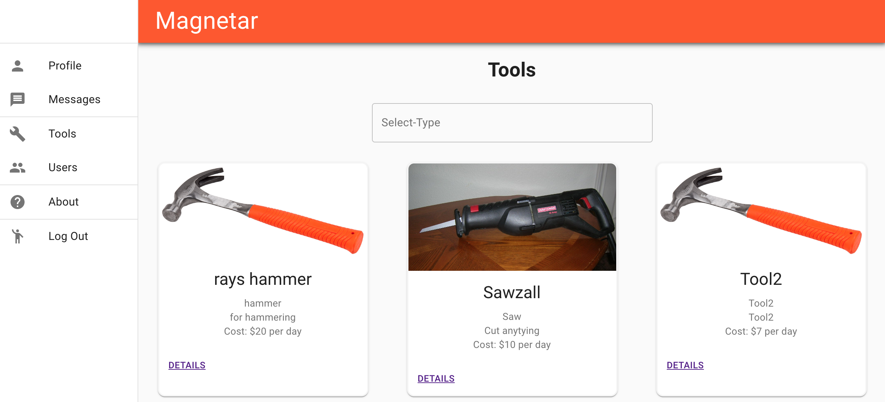

# Magnetar Platform

Magnetear is a tool renting platform with a GraphQL API / PostgreSQL backend and PWA frontend written in React (TypeScript). Load balancing is accomplished through NGINX. It is hosted on AWS.

## Table of Contents

- [Description](#description)
- [Status and Future](#status-and-future)
- [CI](#ci)

## Description

Magnetar allows users to rent and loan tools. For many people, the tools they have do nothing but sit in a shed or on a workbench for >99% of the time. Magnetar turns what is essentially unused inventory into a revenue generator with minimal effort. On the flip side, it helps people find a specific tool they need to complete a project.

## Status and Future

Magnetar is in active development (December 2019) and can be accessed at https://magnetar-env.pjsnaganrf.us-east-2.elasticbeanstalk.com.

## CI

Magnetar uses Travis-CI for CI, with Jest and Enzyme used for testing purposes. Prettier is used for code consistency.
